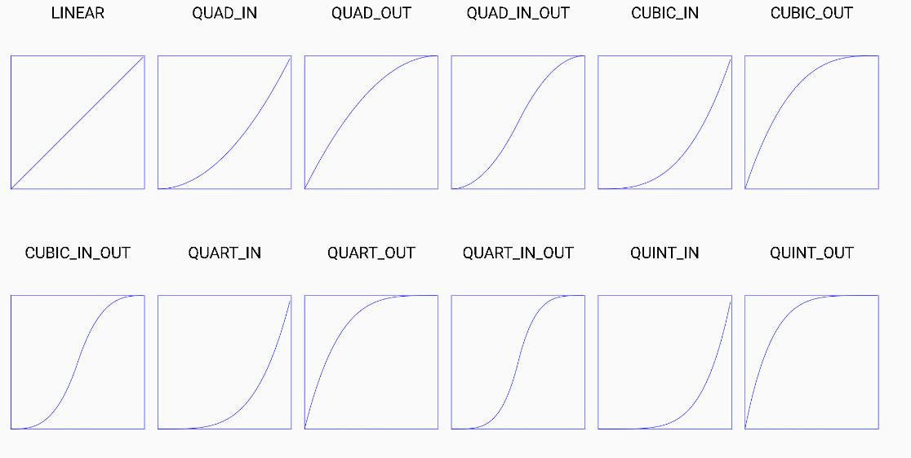
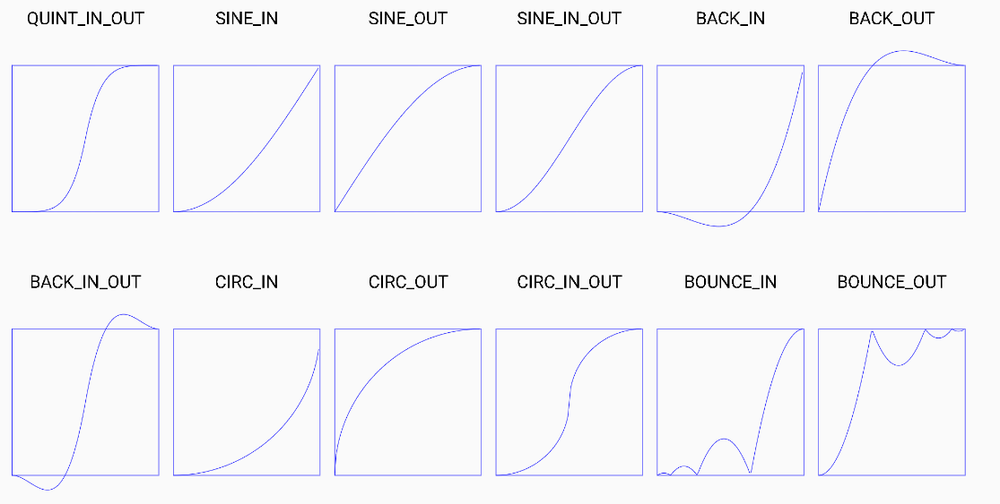
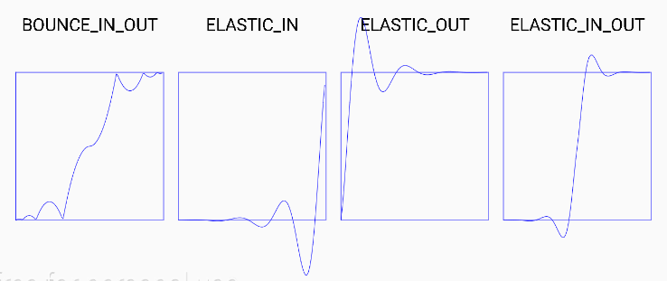

# EasingInterpolator

Twenty-seven different easing animation interpolators for Android. 
It does not use the standard 4 param ease signature. Instead it uses a single param which indicates the current linear ratio (0 to 1) of the tween. 

